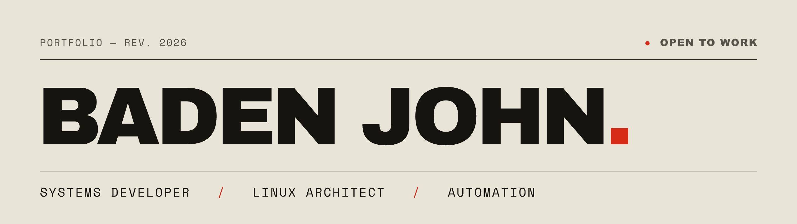

<p align="center">
  <a href="https://badenjohn.dev">
    
  </a>
</p>

> I build the layer beneath the layer you see — kernel-adjacent code,
> reproducible infrastructure, and the pipelines that ship it.
> Quietly, reliably, fast.

```text
$ whoami
baden john — systems developer · linux architect · automation

$ cat principles.txt
01  low-level first       know the machine before you trust the abstraction
02  measure, then cut     latency budgets decide architecture, not vibes
03  reliability by design build for graceful degradation, not the happy path
04  automate the toil     done twice by hand → it becomes a script
05  simple over clever    boring tech, sharp execution
```

`Linux` / `eBPF` / `Rust` / `Kubernetes` / `Automation` / `Nix` / `Observability` / `gRPC` / `Kernel`

**[badenjohn.dev](https://badenjohn.dev)** · [hello@badenjohn.dev](mailto:hello@badenjohn.dev)

<sub>● Open to work · Rev. 2026</sub>
